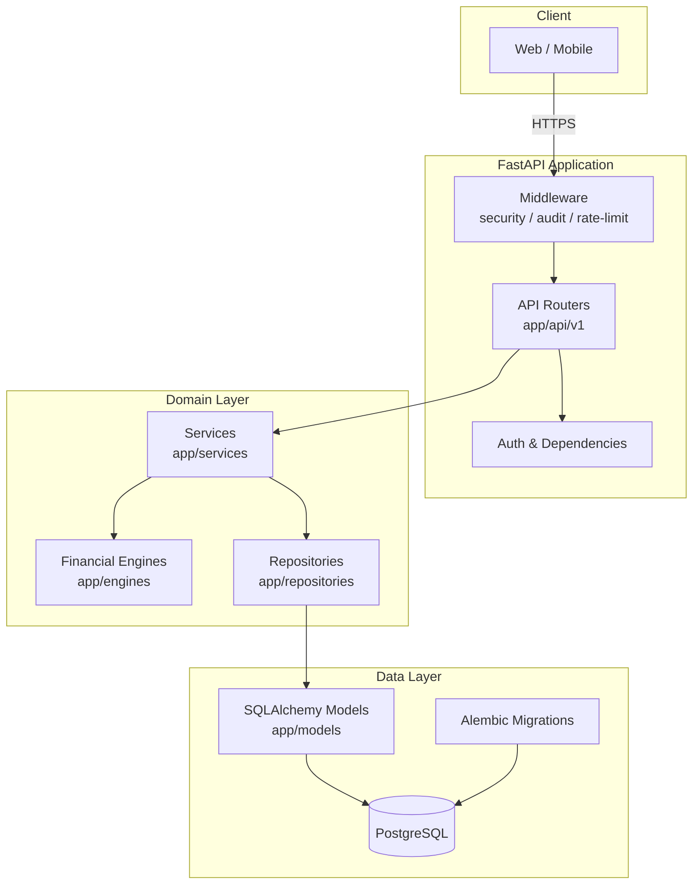

# FinArivu AI - Backend Architecture

This document describes the high-level architecture of the FinArivu AI FastAPI backend.

## Design Principles

- **Clean Architecture**: Business logic is isolated from the web layer.
- **Feature-first modular design**: Each domain lives in a dedicated module.
- **Repository + Service pattern**: Routes delegate to services, which orchestrate repositories.
- **Async first**: SQLAlchemy 2.0 async ORM with `asyncpg` for PostgreSQL.
- **Type safety**: Pydantic v2 schemas enforce strict validation.
- **Security**: Clerk JWT authentication, AES-256-GCM encryption, audit logging, rate limiting.

## Layer Diagram

## Request Flow

1. **Middleware**: security headers, CORS, audit logging and rate limiting.
2. **Authentication**: `get_current_user_id` validates the Clerk JWT (or HS256 fallback in dev/tests).
3. **Routing**: the request is dispatched to the feature router under `app/api/v1`.
4. **Service**: the route calls a service method. Services hold business rules and orchestration.
5. **Engine**: deterministic financial calculations live in `app/engines`.
6. **Repository**: persistence logic is delegated to `app/repositories`.
7. **Model**: repositories read/write `SQLAlchemy 2.0` declarative models in `app/models`.
8. **Response**: a `success_response` JSON wrapper is returned with the result.

## Feature Modules

| Module            | Responsibility                                  |
|-------------------|------------------------------------------------|
| `app/api/v1`      | HTTP routes, validation, auth                  |
| `app/services`    | Business logic, transaction orchestration      |
| `app/repositories`| Data access, CRUD, query helpers               |
| `app/engines`     | Pure financial calculations (tax, retirement, net-worth, health, budget, goals) |
| `app/models`      | SQLAlchemy declarative domain models           |
| `app/schemas`     | Pydantic request/response DTOs                 |
| `app/core`        | Config, database, security, encryption, cache  |
| `app/middleware`  | Audit, rate limiting, security headers         |
| `app/seed`        | Master data seeding (expense categories)       |
| `app/exceptions`  | Custom exceptions and global handlers          |

## Technology Stack

- **Python** 3.13+
- **FastAPI** + **Uvicorn**
- **SQLAlchemy 2.0** async with **asyncpg**
- **Pydantic v2** + **pydantic-settings**
- **Alembic** for migrations
- **Clerk** JWT authentication
- **OpenAI / Groq / Gemini** for the AI chatbot (fallback chain)
- **slowapi** for rate limiting
- **pytest-asyncio** + **pytest-cov** for testing
