# FinArivu AI - Entity Relationship Diagram

This diagram shows the main domain entities and their relationships. All tables inherit audit columns (`id`, `created_at`, `updated_at`, `deleted_at`, `created_by`, `updated_by`) from the `Base` model.

```mermaid
erDiagram
    USER ||--o{ INCOME : has
    USER ||--o{ EXPENSE : has
    USER ||--o{ BUDGET : has
    USER ||--o{ GOAL : has
    USER ||--o{ ASSET : has
    USER ||--o{ LIABILITY : has
    USER ||--|| PROFILE : has
    USER ||--o{ NET_WORTH_HISTORY : tracks
    USER ||--o{ FINANCIAL_HEALTH_SCORE : tracks
    USER ||--o{ WEEKLY_REPORT : receives
    USER ||--o{ AI_CONVERSATION : has
    USER ||--o{ AUDIT_LOG : owns
    USER ||--o{ USER_CONSENT : gives
    USER ||--o{ NOTIFICATION_PREFERENCE : has
    EXPENSE_CATEGORY ||--o{ EXPENSE : categorises
    EXPENSE_CATEGORY ||--o{ BUDGET : limits

    USER {
        uuid id PK
        string clerk_id UK
        string email UK
        string role
        boolean is_active
        boolean email_verified
        datetime last_login_at
        json preferences
    }

    PROFILE {
        uuid id PK
        uuid user_id FK
        string full_name
        date date_of_birth
        int age
        string city
        string phone
        string pan
        decimal monthly_income
        int retirement_age
        string risk_profile
        string investment_experience
        string bio
    }

    EXPENSE_CATEGORY {
        uuid id PK
        string name UK
        string description
        string icon
        string color
        boolean is_system
        int display_order
    }

    INCOME {
        uuid id PK
        uuid user_id FK
        string income_type
        string source
        decimal amount
        string currency
        date received_date
        string notes
    }

    EXPENSE {
        uuid id PK
        uuid user_id FK
        uuid category_id FK
        decimal amount
        string currency
        date expense_date
        string payment_method
        string description
        string merchant
    }

    BUDGET {
        uuid id PK
        uuid user_id FK
        uuid category_id FK
        decimal monthly_limit
        string period
        string alert_threshold
    }

    GOAL {
        uuid id PK
        uuid user_id FK
        string goal_name
        string goal_type
        decimal target_amount
        decimal current_amount
        date target_date
        string status
    }

    ASSET {
        uuid id PK
        uuid user_id FK
        string asset_type
        string name
        decimal value
        string currency
        date as_of_date
        boolean is_emergency_fund
        string notes
    }

    LIABILITY {
        uuid id PK
        uuid user_id FK
        string liability_type
        string name
        decimal amount
        string currency
        decimal interest_rate
        date due_date
    }

    NET_WORTH_HISTORY {
        uuid id PK
        uuid user_id FK
        date recorded_date
        decimal total_assets
        decimal total_liabilities
        decimal net_worth
    }

    FINANCIAL_HEALTH_SCORE {
        uuid id PK
        uuid user_id FK
        decimal overall_score
        json breakdown
        date recorded_date
    }

    WEEKLY_REPORT {
        uuid id PK
        uuid user_id FK
        json report_json
        datetime generated_at
    }

    AI_CONVERSATION {
        uuid id PK
        uuid user_id FK
        string session_id
        text user_message
        text bot_response
        boolean flagged
    }

    AUDIT_LOG {
        uuid id PK
        uuid user_id FK
        string action
        string resource_type
        string resource_id
        string ip_address
        json details
    }

    USER_CONSENT {
        uuid id PK
        uuid user_id FK
        string consent_type
        boolean accepted
        datetime accepted_at
        string ip_address
        string user_agent
    }

    NOTIFICATION_PREFERENCE {
        uuid id PK
        uuid user_id FK
        string channel
        boolean enabled
        string frequency
    }
```

## Notes

- **Soft deletes** are implemented on `Base` through the `deleted_at` column.
- **Audit columns** (`created_at`, `updated_at`, `created_by`, `updated_by`) exist on every table.
- **Cascading deletes** from `User` remove owned child records (`Income`, `Expense`, `Budget`, `Goal`, `Asset`, `Liability`).
- `ExpenseCategory` is master data seeded with system categories such as Food, Rent, Travel, Utilities, Healthcare, Entertainment, Education, Shopping, Insurance and Other.
